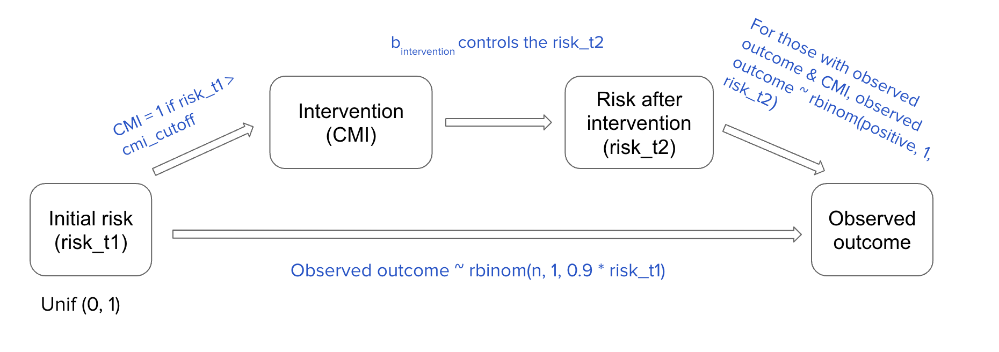
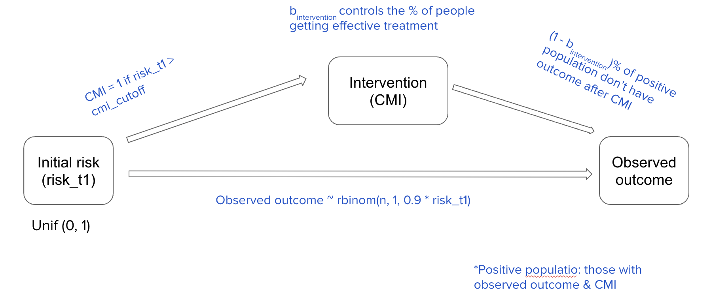

```{r include = FALSE}
knitr::opts_chunk$set(echo = FALSE, warning = FALSE, message = FALSE, fig.keep = 'all', out.width = "80%", fig.align = 'center', fig.pos = "H", out.extra = '')
```

```{r}
library(kableExtra)
library(tidyverse)
library(dplyr)
library(piercer)
library(tidyverse)
library(magrittr)
library(ggplot2)
library(prodlim)
library(gtsummary)
library(foreach)
library(pROC)
library(predtools)
library(boot)
library(glmnet)
library(kableExtra)
library("lattice")
```

## Background & Motivation

Electronic health records (EHRs) data are widely used for clinical research. The abundance of available data, the low cost of obtaining those observational data, and its real-time nature have given EHR enormous potential to develop powerful predictive models. Researchers rely on EHR data extensively to predict the risk of clinical outcomes. As clinical prediction models (CPMs) find their way into clinical practice, it is important to develop systems and procedures to monitor their safety and effectiveness. The Food and Drug Administration (FDA) has developed draft guidance for how such tools should be considered. Within Duke University Health System, a governance framework has been developed for evaluating and monitoring the performance of CPMs to ensure their adequate performance. 

After implementing a CPM, medical professionals will use these models to inform clinical decision-making and allocation of interventions. Ideally, the intervention will prevent the outcome that the CPM is predicting. This leads to an important challenge: how do we evaluate CPMs in the presence of interventions? If the CPM is accurate, and the intervention is effective, those who are truly at risk of the adverse outcome will not actually have the event. To evaluate the CPM appropriately, we are interested in what the causal inference refers to as the counterfactual: the outcome that would have occurred without the intervention being deployed. Unfortunately, we do not observe this counterfactual.

Current research on EHR data has investigated several sources of biases such as selection bias informed presence bias, and confounding, and proposed approaches to control these biases. However, little work has considered this potential bias which has been labeled: Confounding by Medical Interventions (CMIs). The little literature on this topic has focused on how we can learn new CPMs in the presence of CMI. The suggestions to mitigate this bias include using data with no CMI for model training or treating all observations with CMI as unhealthy (based on the trust in medical professionals’ judgment). Although the researchers were able to improve the classification accuracy using these methods, ignoring data with CMI during training reduced the generalizability of the model to validation data, and assigning all data with CMI with negative labels did not perform well enough. As such, the literature is not well developed. This project seeks to study how CMI can impact our ability to evaluate CPMs and the strategies we can use to address these challenges. We first propose possible causal models. Next, we use simulation to both illustrate the problem and explore potential solutions. Then, we will evaluate these approaches in real-world healthcare data.

## Exploratory analysis

During the initial stage of investigation, we proposed 2 possible causal models to illustrate and pinpoint the problem. The variables included in the causal models are initial risk, intervention (1 = intervention, 0 = no intervention), prevalence of disease, and the observed outcome (1 = sick, 0 = healthy). In a simulated scenario, a patient with initial risk higher than the intervention cutoff ($CMI$) will receive intervention treatment. The effectiveness of treatment is decided by $\beta_{intervention}$. In general, a higher $\beta_{intervention}$ means lower effectiveness. We simulate three levels of disease prevalence rate: high (~50% population have the illness without intervention), moderate (~25% population have the illness without intervention), and low (~6% population have the illness without intervention). A highly prevalent disease includes hypertension, a moderately prevalent disease includes Hepatitis B, and a low-prevalent disease includes Chronic obstructive pulmonary disease. What differentiates the 2 models is the mechanism to generate the final observed outcome with intervention. The first model calculates a new risk (risk after intervention) for patients who should have had outcome due to higher initial risk and also received intervention treatment. Depending on the treatment strength, the patient who would have been sick might end up become healthy. According to the new risk, the final observed outcome is generated probabilistically. The second model doesn't consider risk after intervention. Instead, depending on the intervention effectiveness factor $\beta_{intervention}$, we set (1-$\beta_{intervention}$) % of the population to be assigned to have no outcome (healthy), which means their intervention is successful. 

In the real world, only the initial risk and observed outcome are known to health professionals. With the confounding intervention variable, we ideally want to achieve a prediction power as good as predicting outcome directly from the known initial risk. We choose to evaluate the models using area under the curve (AUC), mean squared error (MSE) based on fitted linear predictors and actual outcomes, and calibration slope. These metrics are averaged over 100 simulations. 

## Causal diagram 1


```{r}
set.seed(1)
n <- 1000
repeats <- 10 # for simulation
cmi_cutoff <- 0.5
b_intervention <- 0.2

# generate risk_t1
risk_t1 <- runif(n, 0, 1)
```

- Observed outcome (without intervention) is determined by a binomial distribution as following:

$$x = prevalence + 5 \times risk_{t1}$$ where the AUC is controlled at around 0.8
$$p = exp(x)/(1+exp(x))$$
$$outcome = binomial(n,p)$$

```{r}
gen_outcome1 <- function(risk_t1, n = n, prevalence){
  xb <- prevalence + 5 * risk_t1
  p <- exp(xb)/(1 + exp(xb))
  outcome_noint <- rbinom(n, 1, p)
  df <- as.data.frame(cbind(risk_t1, outcome_noint))
  return (df)
}
a <- gen_outcome1(risk_t1, n, prevalence = -2.5)
# mean(a$outcome_noint)
# ideal_auc <- auc(a$outcome_noint, a$risk_t1)
# prevalence = -6.5: 2%
# prevalence = -4: 25~30%
# prevalence = -2.5: 50%
prevalence <- c(-6, -4, -2.5)
prev <- c("low", "mid", "high") 
```

- CMI/Intervention is present when a patient has $risk_{t1}$ higher than a set `cmi_cutoff`.

- $risk_{t2} = risk_{t1} \times \beta_{intervention}$ if a patient had an outcome and received treatment. Otherwise $risk_{t2}$ remains the same as $risk_{t1}$.

- For patients who had an outcome and received treatment, their observed outcome (with intervention) is re-generated. Say there are m patients like this, then $outcome = binomial(m, risk_{t2})$, while the outcomes of the rest remain to be their outcomes without intervention.

```{r}
gen_cmi <- function(risk_t1, n = n, cmi_cutoff, prevalence){
  df <- gen_outcome1(risk_t1, n, prevalence)
  df <- df %>%
    mutate(cmi = ifelse(risk_t1 > cmi_cutoff, 1, 0)) # the higher the cutoff, the less people getting intervention

  return (df)
}

gen_risk_t2 <- function(risk_t1, n = n, b_intervention, cmi_cutoff, prevalence){
  # if cmi == 1 & outcome_noint == 1, then risk_t2 = risk_t1 * b_intervention
  df <- gen_cmi(risk_t1, n, cmi_cutoff, prevalence)
  df <- df %>%
    mutate(risk_t2 = ifelse((outcome_noint == 1 & cmi == 1),
                            risk_t1 * b_intervention,
                            risk_t1))
  return (df)
}
  
gen_outcome_f1 <- function(risk_t1, n = n, b_intervention,cmi_cutoff, prevalence){
  df <- gen_risk_t2(risk_t1, n, b_intervention, cmi_cutoff, prevalence)
  condition <- df %>%
    filter(outcome_noint == 1 & cmi == 1)

  # 1. generate all observed outcome probabilistically
  # oo: if outcome_no_intervention = 0 & intervention = 0 --> old outcome
  # ol: if outcome_no_intervention = 0 & intervention = 1 --> old outcome
  # lo: if outcome_no_intervention = 1 & intervention = 0 --> old outcome
  # ll: if outcome_no_intervention = 1 & intervention = 1 --> rbinom(n, 1, risks_t2)

  num_obs <- dim(condition)[1]

  xb <- prevalence + 5 * df$risk_t2
  p <- exp(xb)/(1 + exp(xb))
  
  df_final <- df %>%
    mutate(outcome_int = ifelse((outcome_noint  == 1 & cmi == 1),
                                 # rbinom(num_obs, 1, df$risk_t2),
                                rbinom(num_obs, 1, p),
                                outcome_noint))

  return (df_final)
}
```

```{r examine data}
# mse <- 0
# for (i in 1:100){
#     c <- as.data.frame(gen_outcome_f1(risk_t1,
#                                        n,
#                                        b_intervention = 0.9,
#                                        cmi_cutoff = 0.1,
#                                        prevalence = prevalence[1]))
#     fit <- glm(outcome_int ~ risk_t1, data = c, family = binomial,  maxit = 100)
#     y.pred <- predict(fit, as.data.frame(c), type = "response")
#     mse = mse + mean((c$outcome_int - y.pred)^2)
# }
# (mse/100)

model_sum <- expand.grid(prev = prevalence, 
                         b_int = c(0.1, 0.9),
                         cmi = c(0.1, 0.5, 0.9),
                         mean_squared_error = NA)
for (row in 1:dim(model_sum)[1]){
  mse <- 0
  
  for (i in 1:100){
      c <- as.data.frame(gen_outcome_f1(risk_t1,
                                         n,
                                         b_intervention = model_sum$b_int[row],
                                         cmi_cutoff = model_sum$cmi[row],
                                         prevalence = model_sum$prev[row]))
      fit <- glm(outcome_int ~ risk_t1, data = c, family = binomial,  maxit = 100)
      y.pred <- predict(fit, as.data.frame(c), type = "response")
      mse = mse + mean((c$outcome_int - y.pred)^2)
  }
  model_sum$mean_squared_error[row] <- mse/100
}

model_sum <- model_sum %>% 
  arrange(prev)
model_sum

# (mse/100)

# hist(c$risk_t1)
# hist(c$risk_t2)
# hist(c$outcome_noint)
# hist(c$outcome_int)
# fit <- glm(outcome_int ~ risk_t1, data = c, family = binomial,  maxit = 100)
# summary(fit)
# y.pred <- predict(fit, as.data.frame(c), type = "response")
# auc(c$outcome_int, y.pred)
# mean((c$outcome_int - y.pred)^2)
```

### Vary $CMI$ (criteria of giving out treatment)

By varying the bar of giving out treatment, we vary the percentage of population treated.

```{r}
# vary cmi_cutoff
auc_list <- list()
mse_list <- list()
brier_list <- list() # scaled
ideal_auc <- c(NA,3)

for (p in 1:3) {
  cmi.grid <- rep(NA, 10)
  mse.grid <- rep(NA, 10)
  brier.grid <- rep(NA, 10)
  for (i in 1:10) {
    cmi_i <- 0
    mse_i <- 0
    brier_i <- 0
    new_repeats <- repeats
    for (j in 1:repeats){
      c <- as.data.frame(gen_outcome_f1(risk_t1,
                                     n,
                                     b_intervention,
                                     cmi_cutoff = i/10,
                                     prevalence = prevalence[p]))
      # print(c)
      ideal_auc[p] <- auc(c$outcome_noint, c$risk_t1)
      x <- c %>%
        select(-outcome_int)
      y <- c %>%
        select(outcome_int)
  
      # train/test split
      #train <- sample(1:nrow(x), nrow(x)/1.2)
      train <- 1:round(0.8 * nrow(x))
      x.train <- x[train,]
      y.train <- y[train,]
  
      #test <- (-train)
      test <- (round(0.8 * nrow(x)) + 1):nrow(x)
      x.test <- x[test,]
      y.test <- y[test,]
  
      if (!mean(y.test) == 0) { # skip those with only 1 level of outcome
        fit <- glm(y.train ~ risk_t1, data = as.data.frame(x.train), family = binomial, maxit = 100)
        # y.pred <- predict(fit, as.data.frame(x.test)) # predicted result is logit
        y.pred_resp <- predict(fit, as.data.frame(x.test), type = "response") # predicted result is probability
      
        cmi_i = cmi_i + auc(y.test, y.pred_resp)
        # mse_i = mse_i + mean((y.pred - y.test)^2)
        mse_i = mse_i + mean((y.pred_resp - y.test)^2)
        # scaled brier score
        brier_i = brier_i + brier(fit, scaled = TRUE)
      }
      
      else {
        new_repeats = new_repeats - 1
      }
    }
    # AUC
    cmi.grid[i] <- cmi_i/new_repeats
    mse.grid[i] <- mse_i/new_repeats
    brier.grid[i] <- brier_i/new_repeats
  }
  auc_list[[p]] <- cmi.grid
  mse_list[[p]] <- mse.grid
  brier_list[[p]] <- brier.grid
}


par(mfrow = c(2, 3))
for (p in 1:3){
  plot(auc_list[[p]], xlab = "cmi_cutoff", xaxt = "n", ylab = "AUC", ylim = c(0.45, 1),type = "b", sub = paste0("b_intervention = ", b_intervention, "; prevalence = ", prev[p]))
  axis(side=1, at=1:10, labels = seq(0.1, 1, 0.1))
  abline(h = ideal_auc[p], col = "red")
}

for (p in 1:3){
  plot(brier_list[[p]], xlab = "cmi_cutoff", xaxt = "n", ylab = "Scaled Brier Score", ylim = c(0, 1),type = "b", sub = paste0("b_intervention = ", b_intervention, "; prevalence = ", prev[p]))
  axis(side=1, at=1:10, labels = seq(0.1, 1, 0.1))
  abline(h = ideal_auc[p], col = "red")
}

for (p in 1:3){
  plot(mse_list[[p]], xlab = "cmi_cutoff", xaxt = "n", ylab = "MSE", ylim = c(0, 0.5),type = "b", sub = paste0("b_intervention = ", b_intervention, "; prevalence = ", prev[p]))
  axis(side=1, at=1:10, labels = seq(0.1, 1, 0.1))
}
```

The red line in the top panels denotes the ideal prediction power of fitting the observed outcome directly on the initial risk. Note that the higher the cutoff, less people are getting the intervention. In general, when very few or the majority of the population receives treatment, the prediction power is the best. As a disease becomes less prevalent, the overall prediction accuracy and MSE depends less on the percentage of people receiving treatment.


### Vary $\beta_{intervention}$ (effectiveness of treatment)

```{r}
# old_dir <- getwd()
# sink(file = 'sink.txt', split = TRUE)

# vary b_intervention
AUC_list <- list()
MSE_list <- list()
Brier_list <- list()
ideal_auc <- c(NA,3)

for (p in 1:3) {
  AUC.grid <- rep(NA, 10)
  MSE.grid <- rep(NA, 10)
  Brier.grid <- rep(NA, 10)
  new_repeats <- repeats
  for (i in 1:10) {
    AUC_i <- 0
    MSE_i <- 0
    Brier_i <- 0
    for (j in 1:repeats){
      c <- as.data.frame(gen_outcome_f1(risk_t1,
                                     n,
                                     b_intervention = i/10,
                                     cmi_cutoff,
                                     prevalence = prevalence[p]))
      ideal_auc[p] <- auc(c$outcome_noint, c$risk_t1)
      x <- c %>%
        select(-outcome_int)
      y <- c %>%
        select(outcome_int)
      # train/test split
      train <- sample(1:nrow(x), nrow(x)/1.5)
      x.train <- x[train,]
      y.train <- y[train,]
      test <- (-train)
      x.test <- x[test,]
      y.test <- y[test,]
      if (!mean(y.test) == 0) { # skip those with only 1 level of outcome
        fit <- glm(y.train ~ risk_t1, data = as.data.frame(x.train), family = binomial,  maxit = 100)
        y.pred <- predict(fit, as.data.frame(x.test), type = "response")
        AUC_i = AUC_i + auc(y.test, y.pred)
        # MSE_i = MSE_i + mean((y.pred - y.test)^2)
        MSE_i = MSE_i + sqrt(mean((y.pred - y.test)^2))
        Brier_i = Brier_i + brier(fit, scaled = TRUE) # scaled brier
      }
      
      else{
        new_repeats = new_repeats - 1
      }
      
      # print(paste0("i: ", i, "j: ", j, "p: ", p, "diff: ", abs(dim(c1)[1] - dim(c2)[1])))
    }
    # AUC
    AUC.grid[i] <- AUC_i/new_repeats
    MSE.grid[i] <- MSE_i/new_repeats
    Brier.grid[i] <- Brier_i/new_repeats
    # print(AUC.grid)
  }
  AUC_list[[p]] <- AUC.grid
  MSE_list[[p]] <- MSE.grid
  Brier_list[[p]] <- Brier.grid
}
# sink(NULL)

par(mfrow = c(2, 3))
for (p in 1:3){
  plot(AUC_list[[p]], xlab = "b_intervention", xaxt = "n", ylab = "AUC", ylim = c(0.45, 1),type = "b", sub = paste0("cmi_cutoff = ", cmi_cutoff, "; prevalence = ", prev[p]))
  axis(side=1, at=1:10, labels = seq(0.1, 1, 0.1))
  abline(h = ideal_auc[p], col = "red")
}

for (p in 1:3){
  plot(Brier_list[[p]], xlab = "cmi_cutoff", xaxt = "n", ylab = "Scaled Brier Score", ylim = c(0, 1),type = "b", sub = paste0("b_intervention = ", b_intervention, "; prevalence = ", prev[p]))
  axis(side=1, at=1:10, labels = seq(0.1, 1, 0.1))
  abline(h = ideal_auc[p], col = "red")
}

for (p in 1:3){
  plot(MSE_list[[p]], xlab = "b_intervention", xaxt = "n", ylab = "MSE", ylim = c(0, 1),type = "b", sub = paste0("cmi_cutoff = ", cmi_cutoff, "; prevalence = ", prev[p]))
  axis(side=1, at=1:10, labels = seq(0.1, 1, 0.1))
}
```

```{r test}
c %>% 
  filter(risk_t1 >= 0.5 & outcome_int == 1)
c %>% 
  filter(risk_t1 < 0.5 & outcome_int == 1)
```


In the bottom panels, the mean squared error (MSE) is calculated as the difference between the actual outcome and $logit(\hat{p})$ (the linear combination $x = \beta_0 + \beta_1 * risk_{t1}$). As the intervention effectiveness decreases, prediction power increases and MSE decreases. A strong treatment is associated with relatively poor prediction on a patient's final outcome. 

As a disease becomes less prevalent, the overall prediction accuracy and MSE depends less on the effectiveness of treatment. The higher the prevalence rate, delivering effective treatment makes the model perform worse.

To see the trends clearly, we want to track AUC and MSE when $\beta_{intervention}$ and $CMI$ change together. A measure of calibration slope is also added in the following section. Calibration curves evaluate how calibrated a classifier is. From the slope of the curve, we can see whether there is any trend of overestimation or underestimation. The goal is to plot the actual outcome of test data against the linear predictor $\beta_0 + \beta_1 * y.pred$. $y.pred$ is the outcome predicted from test data using logistic regression model trained on $risk_t1$ using the training data. If a model is well calibrated, the slope $\beta_1$ = 1. $\beta_1$ < 1 means overestimation, and $\beta_1$ > 1 means underestimation. 

### Varying $\beta_{intervention}$ and $CMI$

```{r}
# old_dir <- getwd()
# sink(file = 'sink.txt', split = TRUE)

cmi <- seq(0.1, 1, length.out=10)
b_int <- seq(0.1, 1, length.out=10)

aucgrid_list <- list()
msegrid_list <- list()
briergrid_list <- list()
calibrationgrid_list <- list()

for (p in 1:3) {
  data_auc <- expand.grid(X=cmi, Y=b_int)
  data_mse <- expand.grid(X=cmi, Y=b_int)
  data_brier <- expand.grid(X=cmi, Y=b_int)
  data_calibration <- expand.grid(X=cmi, Y=b_int)
  
  auc_table <- matrix(NA, nrow = length(cmi), ncol = length(cmi))
  mse_table <- matrix(NA, nrow = length(cmi), ncol = length(cmi))
  brier_table <- matrix(NA, nrow = length(cmi), ncol = length(cmi))
  calibration_table <- matrix(NA, nrow = length(cmi), ncol = length(cmi))
  
  for (i in 1:10){
    
    for (j in 1:10){
      
      cur_auc <- 0
      cur_mse <- 0
      cur_brier <- 0
      cur_calibration <- 0
      
      count <- 0
      for (k in 1:repeats){
        # if (counter %% 500 == 0){print(paste0("number:", counter, " p:", p, " i:", i, " j:", j))}
        c <- as.data.frame(gen_outcome_f1(risk_t1,
                                       n,
                                       b_intervention = i/10,
                                       cmi_cutoff = j/10,
                                       prevalence = prevalence[p]))
        t <- as.data.frame(gen_outcome_f1(risk_t1,
                                       n,
                                       b_intervention = i/10,
                                       cmi_cutoff = j/10,
                                       prevalence = prevalence[p]))
        
        if (!mean(c$outcome_int) == 0) { 
          count = count + 1
          fit <- glm(outcome_int ~ risk_t1, data = c, family = binomial,  maxit = 100)
          y.pred <- predict(fit, as.data.frame(t), type = "response")
          y.pred_prob <- predict(fit, as.data.frame(t))
          calibration_fit <- glm(t$outcome_int ~ y.pred_prob, family = binomial, data = as.data.frame(t))
          
          cur_auc = cur_auc + auc(c$outcome_int, y.pred)
          cur_mse = cur_mse + mean((y.pred - c$outcome_int)^2)
          cur_brier = cur_mse + brier(fit, scaled = TRUE) # scaled brier
          cur_calibration = cur_calibration + calibration_fit$coefficients[2]
        }
      }

    auc_table[i,j] <- cur_auc/count
    mse_table[i,j] <- cur_mse/count
    brier_table[i,j] <- cur_brier/count
    calibration_table[i,j] <- cur_calibration/count
    # print(paste0("new repeats:", new_repeats))
      
    }

  }
  
  aucgrid_list[[p]] <- auc_table
  msegrid_list[[p]] <- mse_table
  briergrid_list[[p]] <- brier_table
  calibrationgrid_list[[p]] <- calibration_table
}
# sink(NULL)

# remove outliers
for (p in 1:3){
  calibrationgrid_list[[p]] [calibrationgrid_list[[p]]  > 3 | calibrationgrid_list[[p]]  < 0.5] <- mean(calibrationgrid_list[[p]])
}

# plot
auc_heatmap <- list()
for (p in 1:3){
  auc_heatmap[[p]] <- levelplot(aucgrid_list[[p]] ~ X*Y, data=data_auc,
                        main="AUC",
                        xlab="b_int", ylab="cmi",
                        col.regions = heat.colors(1000),
                        sub = paste0(" prevalence = ", prev[p]))
}
cowplot::plot_grid(plotlist = auc_heatmap, ncol = 2)

brier_heatmap <- list()
for (p in 1:3){
  brier_heatmap[[p]] <- levelplot(briergrid_list[[p]] ~ X*Y, data=data_brier,
                        main="Scaled Brier Score",
                        xlab="b_int", ylab="cmi",
                        col.regions = rev(heat.colors(1000)),
                        at=seq(0, 0.25, by = 0.01),
                        sub = paste0(" prevalence = ", prev[p]))
}
cowplot::plot_grid(plotlist = brier_heatmap, ncol = 2)

mse_heatmap <- list()
for (p in 1:3){
  mse_heatmap[[p]] <- levelplot(msegrid_list[[p]] ~ X*Y, data=data_mse,
                        main="Mean Squared Error",
                        xlab="b_int", ylab="cmi",
                        col.regions = rev(heat.colors(1000)),
                        at=seq(0, 0.25, by = 0.01),
                        sub = paste0(" prevalence = ", prev[p]),
                        pretty = TRUE)
}
cowplot::plot_grid(plotlist = mse_heatmap, ncol = 2)

calibration_heatmap <- list()
for (p in 1:3){
  calibration_heatmap[[p]] <- levelplot(calibrationgrid_list[[p]] ~ X*Y, data=data_calibration,
                                        main="Calibration curve slope",
                                        xlab="b_int", ylab="cmi",
                                        col.regions = cm.colors(1000),
                                        at=seq(0.6, 1.4, length.out=1000),
                                        sub = paste0(" prevalence = ", prev[p]))
}
cowplot::plot_grid(plotlist = calibration_heatmap, ncol = 2)
```

```{r}
plot(t$outcome_int ~ y.pred)
abline(glm(t$outcome_int ~ y.pred, family = binomial, data = as.data.frame(t)))
```


```{r}
# par(mfrow = c(3,1))
# hist(calibrationgrid_list[[1]], xlim = c(-1,4), breaks = seq(-1,3,0.2))
# axis(side=1, at=seq(-1,3,0.2), labels=seq(-1,3,0.2))
# hist(calibrationgrid_list[[2]], xlim = c(-1,4), breaks = seq(-1,3,0.2))
# axis(side=1, at=seq(-1,3,0.2), labels=seq(-1,3,0.2))
# hist(calibrationgrid_list[[3]], xlim =  c(min(calibrationgrid_list[[3]]), max(calibrationgrid_list[[3]])), breaks = seq(min(calibrationgrid_list[[3]]), max(calibrationgrid_list[[3]]),0.2))
# axis(side=1, at=seq(-1,3,0.2), labels=seq(-1,3,0.2))
```

The trend of changes in AUC is more intuitive in mid- to high- prevalent diseases. Moving from bottom to top, if close to half of population receives treatment, the prediction performance is the worst. However, if almost everyone or no one receives treatment, we see better performance. Moving from left to right, as intervention effectiveness decreases, AUC increases and MSE decreases. As prevalence rate increase, MSE decreases overall.

Most of the calibration slope range from 0.8 to 1.2. For low prevalent diseases, there is overall underestimation which doesn't have a trend with changes in $\beta_{intervention}$ and $CMI$. Moderately prevalent diseases shows the least overall over/underestimation. Although no obvious trends are present, the more extreme values appear when intervention is more effective. For high prevalent disease, there are clear over- and under- estimation when a treatment is more effective; however, when the treatment effect is very poor, the model is calibrated well, generally approaching a slope of 1.

## Important variables

```{r}
# df <- data.frame(matrix(NA, nrow = 0, ncol = 4))
# df  
# names <- c("b_intervention", "cmi_cutoff", "prevalence", "AUC")
# colnames(df) <- names

b_int <- seq(0.1,1,0.1)
cmi <- seq(0.1,1,0.1)
prev <- prevalence
var <- list(b_intervention = b_int, cmi_cutoff = cmi, prevalence = prev)
df <- expand.grid(var)
df$auc <- unlist(aucgrid_list)
df$brier <-  unlist(msegrid_list)

# fit logistic regression
fit1 <- lm(auc ~ cmi_cutoff^2 + b_intervention + prevalence,
           data = df)
fit2 <- lm(brier ~ cmi_cutoff^2 + b_intervention + prevalence,
           data = df)
summary(fit1)
# 
# sum_table <-  data.frame(
#   Variable = c("cmi_cutoff", "b_intervention", "prevalence"),
#   Estimate  = c(fit1$coefficients[2], fit1$coefficients[3], fit1$coefficients[4]),
#   Std.error = c(0.010802, 0.010802, 0.002164),
#   t_value   = c(3.322, 6.493, -14.161),
#   p_value = c(0.001, "<0.001", "<0.001")
# )
# 
# kable(
#   sum_table,
#   col.names = c(colnames(sum_table)),
#   digits = 2,
#   caption = "Relationship between AUC and predictors"
# )

```

We investigate whether $CMI$, $\beta_{intervention}$, or $prevalence$ are significant influencers for AUC. Variables are fitted against AUC. By observing the p-value and t-statistics, we see that $\beta_{intervention}$ and $prevalence$ are more significant than $CMI$. We are also more confident that $prevalence$ is a significant predictor with the highest t-value.


## Causal diagram 2


```{r}
gen_outcome_f2 <- function(risk_t1, n = n, b_intervention, cmi_cutoff, prevalence){
    df <- gen_risk_t2(risk_t1, n, b_intervention, cmi_cutoff,prevalence)
  condition <- df %>%
    filter(outcome_noint == 1 & cmi == 1)

  # 2. choose (1-b_intervention) % of the ppl (outcome_no_intervention = 1 & intervention = 1) to have
  # outcome = 0

  # i.e. b_intervention = 0.1 (very effective treatment), then 90% change their 1 to 0
  effective <- sample_frac(condition, size = 1-b_intervention, replace = FALSE)
  effective_df <- subset(df,(risk_t1 %in% effective$risk_t1 &
                               outcome_noint %in% effective$outcome_noint &
                               cmi %in% effective$cmi &
                               risk_t2 %in% effective$risk_t2))

  non_effective_df <- subset(df,!(risk_t1 %in% effective$risk_t1 &
                                    outcome_noint %in% effective$outcome_noint &
                                    cmi %in% effective$cmi &
                                    risk_t2 %in% effective$risk_t2))
  effective_df$outcome_int <- 0
  non_effective_df$outcome_int <- non_effective_df$outcome_noint
  df_final <- rbind(effective_df, non_effective_df)

  return (df_final)
}

# a <- gen_outcome_f2(risk_t1, n = n, b_intervention = 9/10, cmi_cutoff = 0.3, prevalence = prevalence[2])
```


### Vary $CMI$ (criteria of giving out treatment)
```{r}
# vary cmi_cutoff
auc_list <- list()
mse_list <- list()
ideal_auc <- c(NA,3)
for (p in 1:3) {
  cmi.grid <- rep(NA, 9)
  mse.grid <- rep(NA, 9)
  for (i in 1:9) {
    cmi_i <- 0
    mse_i <- 0
    for (j in 1:repeats){
      c <- as.data.frame(gen_outcome_f2(risk_t1,
                                     n,
                                     b_intervention,
                                     cmi_cutoff = i/10,
                                     prevalence = prevalence[p]))
      ideal_auc[p] <- auc(c$outcome_noint, c$risk_t1)
      x <- c %>%
        select(-outcome_int)
      y <- c %>%
        select(outcome_int)
  
      # train/test split
      train <- sample(1:nrow(x), nrow(x)/2)
      x.train <- x[train,]
      y.train <- y[train,]
  
      test <- (-train)
      x.test <- x[test,]
      y.test <- y[test,]
  
      fit <- glm(y.train ~ risk_t1, data = as.data.frame(x.train), family = binomial,  maxit = 100)
      y.pred <- predict(fit, as.data.frame(x.test))
      cmi_i = cmi_i + auc(y.test, y.pred)
      mse_i = mse_i + mean((y.pred - y.test)^2)
    }
    # AUC
    cmi.grid[i] <- cmi_i/repeats
    mse.grid[i] <- mse_i/repeats
  }
  auc_list[[p]] <- cmi.grid
  mse_list[[p]] <- mse.grid
}

par(mfrow = c(2, 3))
for (p in 1:3){
  plot(auc_list[[p]], xlab = "cmi_cutoff", xaxt = "n", ylab = "AUC", ylim = c(0.45, 1),type = "b", sub = paste0(" b_intervention = ", b_intervention, "; prevalence = ", prev[p]))
  axis(side=1, at=1:10, labels = seq(0.1, 1, 0.1))
  abline(h = ideal_auc[p], col = "red")
}

for (p in 1:3){
  plot(mse_list[[p]], xlab = "cmi_cutoff", xaxt = "n", ylab = "MSE", ylim = c(0, 30),type = "b", sub = paste0("b_intervention = ", b_intervention, "; prevalence = ", prev[p]))
  axis(side=1, at=1:10, labels = seq(0.1, 1, 0.1))
}
```

### Vary $\beta_{intervention}$ (effectiveness of treatment)

```{r}
# vary b_intervention
AUC_list <- list()
MSE_list <- list()

for (p in 1:3) {
  AUC.grid <- rep(NA, 9)
  MSE.grid <- rep(NA, 9)
  for (i in 1:9) {
    AUC_i <- 0
    MSE_i <- 0
    for (j in 1:repeats){
      c <- as.data.frame(gen_outcome_f2(risk_t1,
                                     n,
                                     b_intervention = i/10,
                                     cmi_cutoff,
                                     prevalence = prevalence[p]))
      ideal_auc[p] <- auc(c$outcome_noint, c$risk_t1)
      x <- c %>%
        select(-outcome_int)
      y <- c %>%
        select(outcome_int)
      # train/test split
      train <- sample(1:nrow(x), nrow(x)/2)
      test <- (-train)
      while (mean(y[test,]) == 0) { # there is only 1 level in test data, keep sampling
        train <- sample(1:nrow(x), nrow(x)/2)
        test <- (-train)
      }
      x.train <- x[train,]
      y.train <- y[train,]
      
      x.test <- x[test,]
      y.test <- y[test,]
      fit <- glm(y.train ~ risk_t1, data = as.data.frame(x.train), family = binomial,  maxit = 100)
      # fit_sum <- summary(fit)
      y.pred <- predict(fit, as.data.frame(x.test))
      AUC_i = AUC_i + auc(y.test, y.pred)
      MSE_i = MSE_i + mean((y.pred - y.test)^2)
    }
    # AUC
    AUC.grid[i] <- AUC_i/repeats
    MSE.grid[i] <- MSE_i/repeats
  }
  AUC_list[[p]] <- AUC.grid
  MSE_list[[p]] <- MSE.grid
}

par(mfrow = c(2, 3))
for (p in 1:3){
  plot(AUC_list[[p]], xlab = "b_intervention", xaxt = "n", ylab = "AUC", ylim = c(0.45, 1),type = "b", sub = paste0("cmi_cutoff = ", cmi_cutoff, "; prevalence = ", prev[p]))
  axis(side=1, at=1:10, labels = seq(0.1, 1, 0.1))
  abline(h = ideal_auc[p], col = "red")
}

for (p in 1:3){
  plot(MSE_list[[p]], xlab = "b_intervention", xaxt = "n", ylab = "MSE", ylim = c(0, 100),type = "b", sub = paste0("cmi_cutoff = ", cmi_cutoff, "; prevalence = ", prev[p]))
  axis(side=1, at=1:10, labels = seq(0.1, 1, 0.1))
}
```

### Varying $\beta_{intervention}$ and $CMI$

```{r results="hide"}
# old_dir <- getwd()
# sink(file = 'sink2.txt', split = TRUE)

cmi <- seq(0.1, 0.9, length.out=9)
b_int <- seq(0.1, 0.9, length.out=9)

aucgrid_list <- list()
msegrid_list <- list()
calibrationgrid_list <- list()

# counter <- 0
foreach(p=1:3) %do% {
  data_auc <- expand.grid(X=cmi, Y=b_int)
  data_mse <- expand.grid(X=cmi, Y=b_int)
  data_calibration <- expand.grid(X=cmi, Y=b_int)
  
  auc_table <- matrix(NA, nrow = length(cmi), ncol = length(cmi))
  mse_table <- matrix(NA, nrow = length(cmi), ncol = length(cmi))
  calibration_table <- matrix(NA, nrow = length(cmi), ncol = length(cmi))
  
  for (i in 1:9){
    for (j in 1:9){
      cur_auc <- 0
      cur_mse <- 0
      cur_calibration <- 0
      for (k in 1:repeats){
        # counter <- counter + 1
        # if (counter %% 500 == 0){print(paste0("number:", counter, " p:", p, " i:", i, " j:", j))}
        c <- as.data.frame(gen_outcome_f1(risk_t1,
                                       n,
                                       b_intervention = i/10,
                                       cmi_cutoff = j/10,
                                       prevalence = prevalence[p]))
        x <- c %>%
          select(-outcome_int)
        y <- c %>%
          select(outcome_int)
  
        # train/test split
        train <- sample(1:nrow(x), nrow(x)/2)
        x.train <- x[train,]
        y.train <- y[train,]
  
        test <- (-train)
        x.test <- x[test,]
        y.test <- y[test,]
  
        fit <- glm(y.train ~ risk_t1, data = x.train, family = binomial, maxit = 100)
        y.pred <- predict(fit, as.data.frame(x.test))
  
        # update auc and mse
        cur_auc <- cur_auc + auc(y.test, y.pred)
        cur_mse <- cur_mse + mean((y.pred - y.test)^2)
  
        calibration_fit <- glm(y.test ~ y.pred, family = "binomial", data = as.data.frame(x.test))
  
        cur_calibration <- cur_calibration + calibration_fit$coefficients[2]
      }
  
      auc_table[i,j] <- cur_auc/repeats
      mse_table[i,j] <- cur_mse/repeats
      calibration_table[i,j] <- cur_calibration/repeats
      # print(paste0("b_intervention =", i, "cmi = ", j, "mse = ", mse_table[i,j]))
    }
  }
  aucgrid_list[[p]] <- auc_table
  msegrid_list[[p]] <- mse_table
  calibrationgrid_list[[p]] <- calibration_table
}
# sink(NULL)

# remove outliers
for (p in 1:3){
  calibrationgrid_list[[p]] [calibrationgrid_list[[p]]  > 2 | calibrationgrid_list[[p]]  < 0.6] <- mean(calibrationgrid_list[[p]])
}

# plot

auc_heatmap <- list()
for (p in 1:3){
  auc_heatmap[[p]] <- levelplot(aucgrid_list[[p]] ~ X*Y, data=data_auc,
                        main="AUC",
                        xlab="b_int", ylab="cmi",
                        col.regions = heat.colors(1000),
                        sub = paste0(" prevalence = ", prev[p]))
}
cowplot::plot_grid(plotlist = auc_heatmap, ncol = 2)

mse_heatmap <- list()
for (p in 1:3){
  mse_heatmap[[p]] <- levelplot(msegrid_list[[p]] ~ X*Y, data=data_mse,
                        main="Mean Squared Error",
                        xlab="b_int", ylab="cmi",
                        col.regions = rev(heat.colors(1000)),
                        at=seq(0, 45, by = 1),
                        sub = paste0(" prevalence = ", prev[p]),
                        pretty = TRUE)
}
cowplot::plot_grid(plotlist = mse_heatmap, ncol = 2)

calibration_heatmap <- list()
for (p in 1:3){
  calibration_heatmap[[p]] <- levelplot(calibrationgrid_list[[p]] ~ X*Y, data=data_calibration,
                                        main="Calibration curve slope",
                                        xlab="b_int", ylab="cmi",
                                        col.regions = cm.colors(1000),
                                        at=seq(0.6, 1.4, length.out=1000),
                                        sub = paste0(" prevalence = ", prev[p]))
}
cowplot::plot_grid(plotlist = calibration_heatmap, ncol = 2)
```

## Important variables
```{r}
# df <- data.frame(matrix(NA, nrow = 0, ncol = 4))
# df  
# names <- c("b_intervention", "cmi_cutoff", "prevalence", "AUC")
# colnames(df) <- names

b_int <- seq(0.1,0.9,0.1)
cmi <- seq(0.1,0.9,0.1)
prev <- prevalence
var <- list(b_intervention = b_int, cmi_cutoff = cmi, prevalence = prev)
df <- expand.grid(var)
df$auc <- unlist(aucgrid_list)
df$brier <-  unlist(msegrid_list)

# fit logistic regression
fit1 <- lm(auc ~ cmi_cutoff^2 + b_intervention + prevalence,
           data = df)
fit2 <- lm(brier ~ cmi_cutoff^2 + b_intervention + prevalence,
           data = df)
summary(fit1)

# sum_table <-  data.frame(
#   Variable = c("cmi_cutoff", "b_intervention", "prevalence"),
#   Estimate  = c(0.035880, 0.070138, -0.030645),
#   Std.error = c(0.010802, 0.010802, 0.002164),
#   t_value   = c(3.322, 6.493, -14.161),
#   p_value = c(0.001, "<0.001", "<0.001")
# )
# 
# kable(
#   sum_table,
#   col.names = c(colnames(sum_table)),
#   digits = 2,
#   caption = "Relationship between AUC and predictors"
# )

```

Conclusions of the trend of MSE, AUC, calibration slope, and variable importance are similar as the first causal diagram.

## Next steps

We have illustrated the research question by simulating health risks as well as intervention percentage and effectiveness. We identified the scenarios where prediction models are prone to low prediction power, high error rate, and poor calibration. In general, rarer diseases have a high error rate and overall underestimation of health outcome and also presents an AUC trend different from higher prevalent diseases. More investigation will be done in the future on this behavior. In terms of the 3 evaluation metrics, the prediction model performs the best when a disease is highly prevalent (50%) and treatment is almost not effective at all. However, this is not an ideal scenario in the real world. 

The next steps include exploring methods that mitigate the problems mentioned in the above sections. We will also address some limitations in the evaluation metrics, such as using scaled brier scores to track model error rates. 

