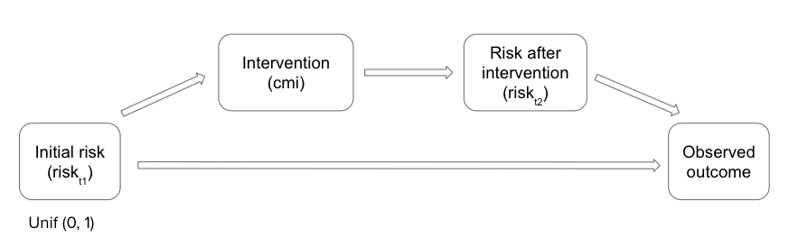

\vspace{-0.5 cm}

```{r setup, include=FALSE, results='hide', message=FALSE, warning=FALSE}
knitr::opts_chunk$set(echo = FALSE, warning = FALSE, message = FALSE,
                      fig.align = 'center', fig.pos = "H", out.extra = '', 
                      cache = FALSE, eval = TRUE)
```

```{r}
library(kableExtra)
library("lattice")
library(gridExtra)
library(gtable)
library(tidyverse)
library(dplyr)
library(piercer)
library(magrittr)
library(ggplot2)
library(prodlim)
library(broom)
library(gtsummary)
library("ggpubr")
library(foreach)
library(pROC)
library(predtools)
library(boot)
library(glmnet)
```

## Abstract

Clinical prediction models (CPMs) using electronic health records (EHRs) data has inaccurate capture of patient outcomes when medical intervention is present. We considered two intervention scenario implemented in medical services and illustrated the factors that influence the performance of CPMs: the effectiveness of intervention, the prevalence of disease, and the percentage of population receiving intervention. Then, we proposed 2 correction methods that improve CPM performance. Under a resource-constrained intervention scenario, stratified intervention approach is superior, especially when the disease is rare. Under a point-of-care intervention scenario, the adjusted posterior risk is superior, especially when the disease is common.


## 1. Introduction

Electronic health records (EHRs) data are widely used for clinical research. The abundance of available data, the low cost of obtaining those observational data, and its real-time nature have given EHR enormous potential to develop powerful predictive models [@Goldstein2017]. Researchers rely on EHR data extensively to predict the risk of clinical outcomes. As clinical prediction models (CPMs) find their way into clinical practice, it is important to develop systems and procedures to monitor their safety and effectiveness. The Food and Drug Administration (FDA) has developed draft guidance for how such tools should be considered [@FDA2022]. Within Duke University Health System, a governance framework has been developed for evaluating and monitoring the performance of CPMs to ensure their adequate performance.

After implementing a CPM, medical professionals will use these models to inform clinical decision-making and allocation of interventions. Ideally, the intervention will prevent the outcome that the CPM is predicting. This leads to an important challenge: how do we evaluate CPMs in the presence of interventions? If the CPM is accurate, and the intervention is effective, those who are truly at risk of the adverse outcome will not actually have the event. To evaluate the CPM appropriately, we are interested in what the causal inference refers to as the counterfactual: the outcome that would have occurred without the intervention being deployed. Unfortunately, we do not observe this counterfactual.

Current research on EHR data has investigated several sources of biases such as selection bias informed presence bias, and confounding, and proposed approaches to control these biases. However, little work has considered this potential bias which has been labeled: Confounding by Medical Interventions (CMIs). The little literature on this topic has focused on how we can learn new CPMs in the presence of CMI. The suggestions to mitigate this bias include using data with no CMI for model training or treating all observations with CMI as unhealthy (based on the trust in medical professionals' judgment). Although the researchers were able to improve the classification accuracy using these methods, ignoring data with CMI during training reduced the generalizability of the model to validation data, and assigning all data with CMI with negative labels did not perform well enough [@Paxton2013]. In general, the literature is not well developed. This project seeks to study how CMI can impact our ability to evaluate CPMs and the strategies we can use to address these challenges. We first propose possible causal models. Next, we use simulation to both illustrate the problem and explore potential solutions. Then, we will evaluate these approaches in real-world healthcare data.

## 2. Simulationg of confounded EHR data

During the initial stage of investigation, we proposed two possible causal models to illustrate and pinpoint the research problem. The variables included in the causal models are initial risk, intervention (`1` = intervention, `0` = no intervention), prevalence of disease, and the observed outcome (`1` = sick, `0` = healthy). In a simulated scenario, a patient with initial risk higher than the intervention cutoff (`cmi`) will receive intervention treatment. The effectiveness of treatment is decided by $\beta_{intervention}$. In general, a higher $\beta_{intervention}$ means lower effectiveness. New risk (risk after intervention) are calculated for patients who should have had outcome due to higher initial risk and also received intervention treatment. Depending on the treatment strength, the patient who would have been sick might end up become healthy. According to the new risk, the final observed outcome is generated probabilistically. The two causal models differ in their mechanisms of intervention. The first model is based on resource-constrained intervention. In this case, medical resource is limited so that only patients with high-enough initial risks are eligible to receive intervention. This standard is determined by a `cmi` cutoff on risk. The second model is based on point-of-care intervention. Medical resources is not limited, and rapid clinical decision are made in the process of diagnosis. We simulate medical professionals’ subjective decision process by setting the probability of receiving care as proportional to the diagnosed risk.



We simulate three levels of disease prevalence rate: high (\~50% population have the illness without intervention), moderate (\~25% population have the illness without intervention), and low (\~6% population have the illness without intervention). A highly prevalent disease includes hypertension, a moderately prevalent disease includes Hepatitis B, and a low-prevalent disease includes Chronic obstructive pulmonary disease.

In the real world, only the initial risk and observed outcome are known to health professionals. With the confounding intervention variable, we ideally want to achieve a prediction power as good as predicting outcome directly from the known initial risk. We evaluate the models using area under the curve (AUC) based on fitted linear predictors and actual outcomes, as well as calibration slope. These metrics are averaged over 100 simulations, with each simulation of 20000 observations:

1.   n = 20000 observations are assigned an initial risk $risk_{t1}$ uniformly distributed from 0 to 1.

2.   Observed outcome (Y) without intervention is determined by a binomial distribution as following:
$x = prevalence + 5 \times risk_{t1}$ where the AUC is controlled at around 0.8. $p = \frac{e^x}{(1+e^x)}, \text{ so that } Y \sim binomial(n, p)$

3.   In case 1, intervention (`cmi`) is present when a patient has $risk_{t1}$ higher than a set `cmi_cutoff`. In case 2, intervention (`cmi`) is proportional to $risk_{t1} \text{ so that } cmi \sim binomial(n, p)$

4.   $risk_{t2} = risk_{t1} \times \beta_{intervention}$ if a patient had an outcome and received treatment. Otherwise, $risk_{t2}$ remains the same as $risk_{t1}$.

5.   For patients who had an outcome and received treatment, their observed outcome (with intervention) is re-generated. Say there are m patients like this, then $Y \sim binomial(m, risk_{t2})$, while the outcomes of the rest remain to be their outcomes without intervention.

A simulated EHR dataset with 20000 patients is generated. the data is split into training (80%) and test (20%). A binary logistic regression model is fit on training data such that $logit(Y) = \beta_0 + \beta_r \times risk_{t1}$. AUC is calculated using the probability of predicted outcome and true outcome from test set. To calculate the calibration slope, the true outcome from test set is regressed on the linear combination of predicted outcome using a binary logistic regression model such that $logit(y) = \gamma_0 + \gamma_p \times \hat y$ where y is the true outcome and $\hat y$ is the linear predictor using the original coefficients $\mathbf {\beta}$. $\gamma_p$ is the calibration slope.

```{r}
set.seed(10)
n <- 20000
repeats <- 100 # for simulation
# repeats <- 10
cmi_cutoff <- 0.7
b_intervention <- 0.2

# generate risk_t1
risk_t1 <- runif(n, 0, 1)

prevalence <- c(-6, -4, -2.5)
# prev <- c("low", "mid", "high") 
prev <- c("low (6%)", "mid (25%)", "high (50%)") 
```


### 2.1 Resource-constrained intervention

#### 2.1.1 Model evalucation under varying intervention effectiveness $\beta_{intervention}$ and bar of intervention `cmi_cutoff`

```{r}
cmi <- seq(0.1, 1, length.out=10)
b_int <- seq(0.1, 1, length.out=10)
data_auc <- expand.grid(X=cmi, Y=b_int)
data_calibration <- expand.grid(X=cmi, Y=b_int)

aucgrid_list <- readRDS("data/causal1_auc_eval")
calibrationgrid_list <- readRDS("data/causal1_calibration_eval")
```


```{r fig.align='center', fig.width= '100%', out.width="85%"}
# plot
auc_heatmap <- list()
for (p in 1:3){
  auc_heatmap[[p]] <- levelplot(aucgrid_list[[p]] ~ X*Y, data=data_auc,
                        main="AUC", 
                         xlab="intervention effectiveness",
                        ylab="intervention cutoff",
                        xlim = c(1, 0),
                        col.regions = rev(heat.colors(1000)),
                        at=seq(0.45, 0.85, length.out=1000),
                        sub = paste0(" prevalence = ", prev[p]))
}
cowplot::plot_grid(plotlist = auc_heatmap, ncol = 2)
```

```{r fig.align='center', fig.width= '100%', out.width="65%"}
# p1 <- auc_heatmap[[1]]
# p1
```

```{r fig.align='center', fig.width= '100%', out.width="65%"}
# p2 <- auc_heatmap[[2]]
# p2
```

```{r fig.align='center', fig.width= '100%', out.width="65%", fig.cap="Area under the curve decreases as intervention becomes more effective"}
# p3 <- auc_heatmap[[3]]
# p3
```

```{r  fig.align='center', fig.width= '100%', out.width="85%", fig.cap="(a) Area under the curve decreases as intervention becomes more effective (b) More over- and under-estimation as intervention becomes more effective"}
calibration_heatmap <- list()
for (p in 1:3){
  calibration_heatmap[[p]] <- levelplot(calibrationgrid_list[[p]] ~ X*Y, data=data_calibration,
                                        main="Calibration slope",
                                        xlab="intervention effectiveness",
                                        ylab="intervention cutoff",
                                        xlim = c(1,0),
                                        col.regions = rev(cm.colors(1000)),
                                        at=seq(0.8, 1.2, length.out=1000),
                                        sub = paste0(" prevalence = ", prev[p]))
}
cowplot::plot_grid(plotlist = calibration_heatmap, ncol = 2)
```

```{r fig.align='center', fig.width= '100%', out.width="65%"}
# p4 <- calibration_heatmap[[1]]
# p4
```

```{r fig.align='center', fig.width= '100%', out.width="65%"}
# p5 <- calibration_heatmap[[2]]
# p5
```

```{r fig.align='center', fig.width= '100%', out.width="65%", fig.cap="More over- and under-estimation as intervention becomes more effective"}
# p6 <- calibration_heatmap[[3]]
# p6
```


Under resource-constrained intervention scenario, the model performance is highly influenced by the effectiveness of intervention $\beta_{intervention}$ as well as the criteria of intervention `cmi_cutoff`. For diseases that are moderately or highly prevalent, less effective intervention is associated with higher AUC hence better predictive performance. This is intuitive because the power of confounding decreases as the intervention becomes weaker, and the predicted outcomes are closer to the ones under direct causal relationship between initial risk and outcome. Because AUC is a rank measure of the probability of a healthy person being ranked more highly than a sick person or vice versa, making half of the population (`cmi` = 0.5) receive treatment presents the worst predictive performance at the same intervention levels. For rarer diseases, the influence of intervention effectiveness is not obvious, possibly due to the lack of disease incidents to begin with. Nonetheless, when the intervention is not effective at all, all models under 3 prevalence scenarios achieved the nearly ideal AUC score controlled at the start of simulation.

Calibration slope of 1 is a perfectly calibrated model (no under- or over- estimation). Less than 1 (pink) means overestimating for patients at high risk, while larger than 1 (blue) means underestimating for patients at low risk. Overall, more prevalence disease has better calibration. For the rarer disease with 6% occurrence rate, there is a trend of underestimating initial risk when most patients get intervention (`cmi_cutoff` = 0.1). For more prevalent diseases, the more effective intervention is, the worse the calibration is.

### 2.1.2 Influential variables on model performance

To quantify the impact of 1) the criteria of intervention, 2) intervention effectiveness, and 3) prevalence on model performance, we regress $\beta_{intervention}$, `cmi_cutoff`, and prevalence on AUC. 
$$
\text{AUC} = \beta_0 + \beta_1 \times \text{cmi cutoff} + \beta_2 \times \text{cmi cutoff}^{2} + \beta_{intervention} \times \text{intervention effectiveness} + \beta_3 \times \text{prevalence}
$$

```{r}
df <- data.frame(matrix(NA, nrow = 0, ncol = 4))
names <- c("b_intervention", "cmi_cutoff", "prevalence", "AUC")
colnames(df) <- names

b_int <- seq(0.1,1,0.1)
cmi <- seq(0.1,1,0.1)
# prev <- prevalence
var <- list(b_intervention = b_int, cmi_cutoff = cmi, prevalence = prevalence)
df <- expand.grid(var)
df$auc <- unlist(aucgrid_list)

# fit logistic regression
fit1 <- lm(auc ~ cmi_cutoff + I(cmi_cutoff^2) + b_intervention + as.factor(prevalence),
           data = df)
summ <- tidy(summary(fit1))
ci <- confint(fit1)
summ_final <- cbind(summ, ci) %>%
  select(-c(1,3,4,5))

summ_final$`95% CI` <- paste0("[", round(summ_final$`2.5 %`,3), ", ", round(summ_final$`97.5 %`,3), "]")

summ_final <- summ_final %>% 
  select(-c(2,3))

rownames(summ_final) <- c("Intercept","cmi cutoff","(cmi cutoff)^2","intervention effectiveness", "prevalence (mid vs. low)", "prevalence (high vs. low)")


```

The model output (Table 1) matches our previous observations. The less effective an intervention is, the higher AUC is. Compared to low prevalence disease (baseline), moderately and highly prevalent disease both have higher overall AUC. For a scenario in which the intervention cutoff is at $risk_{t1} = 0.1$, requiring patients to have an initial risk 10% higher to receive intervention is associated with an AUC change of `r -1.084 + 2 * 1.061 * 0.1`. Under intervention cutoff at $risk_{t1} = 0.5$, the AUC change is `r -1.084 + 2 * 1.061 * 0.5`. Under intervention cutoff at $risk_{t1} = 0.9$, the AUC change is `r -1.084 + 2 * 1.061 * 0.9`. In other words, under a strict intervention criteria, raising the bar for intervention is associated with improved model performance, but model performance becomes worse when the bar is raised under a relaxed intervention criteria.

```{r}
kable(
  summ_final,
  digits = 3,
  caption = "Relationship between AUC and predictors"
)
```


## 2.2 Point-of-care intervention

### 2.2.1 Model evalucation under varying intervention effectiveness $\beta_{intervention}$

```{r out.width="100%", fig.width = "50%"}
b_int <- seq(0.1, 0.9, length.out=9)

auc_list <- readRDS("data/causal2_auc_eval")
calibrationg_list <- readRDS("data/causal2_calibration_eval")
cmi_perclist <- readRDS("data/causal2_cmi_perc_eval")
ideal_auc <- readRDS("data/causal2_ideal_auc")

# plot

par(mfrow = c(2, 3))
for (p in 1:3){
  plot(auc_list[[p]] ~ b_int,
       xlab="intervention effectiveness",
       xlim = rev(range(b_int)),
       ylim = c(0.45, 1),
       ylab = "AUC",
       type = "b", sub = paste0("prevalence and % intervention : ",
                                prev[p])
  )
  axis(side=1, at=10:1, labels = seq(1, 0.1, -0.1), tick = TRUE)
  abline(h = ideal_auc[p], col = "red")
}
```


```{r out.width="100%",  fig.width = "50%", fig.cap="(a) Area under the curve decreases as intervention becomes more effective at mid/high prevalence(b) Calibration is consistent around 1 indicating little over- or under- estimation"}
par(mfrow = c(2, 3))
for (p in 1:3){
  plot(calibrationg_list[[p]] ~ b_int,
       xlab = "b_intervention",
       xlim = rev(range(b_int)),
       ylab = "Calibration slope", ylim = c(0.8, 1.2),
       type = "b", sub = paste0("prevalence and % intervention : ",
                                prev[p])
       )
  axis(side=1, at=10:1, labels = seq(1, 0.1, -0.1), tick = TRUE)
  abline(h = 1, col = "red")
}
```

Under point-of-care intervention scenario, there is no strict criteria of intervention. Rather, patients at higher risk are more likely to receive intervention. The results are similar to the first scenario. The model performance is highly influenced by the effectiveness of intervention $\beta_{intervention}$ as well as disease prevalence. For diseases that are moderately or highly prevalent, less effective intervention is associated with higher AUC hence better predictive performance. For rarer diseases, the influence of intervention effectiveness is not obvious. Different from the first scenario, model achieves near perfect AUC only in the rare disease case. In general, there is little under- or over- estimation. 

### 2.2.2 Influential variables on model performance

To quantify the impact of 1) intervention effectiveness, and 2) prevalence on model performance, we regress $\beta_{intervention}$ and and prevalence on AUC. 
$$
\text{AUC} = \beta_0 + \beta_1 \times \text{b$_{intervention}$} + \beta_3 \times \text{prevalence}
$$

```{r}
df <- data.frame(matrix(NA, nrow = 0, ncol = 3))
names <- c("b_intervention", "prevalence", "AUC")
colnames(df) <- names

b_int <- seq(0.1,0.9,0.1)
# prev <- prevalence
var <- list(b_intervention = b_int, prevalence = prevalence)
df <- expand.grid(var)
df$auc <- unlist(auc_list)
df$calibration <- unlist(calibrationg_list)

# fit logistic regression
fit2 <- lm(auc ~ b_intervention + as.factor(prevalence), data = df)
# fit3 <- lm(calibration ~ b_intervention + as.factor(prevalence), data = df)

summ2 <- tidy(summary(fit2))
ci2 <- confint(fit2)
summ2_final <- cbind(summ2, ci2) %>%
  select(-c(1,3,4,5))

summ2_final$`95% CI` <- paste0("[", round(summ2_final$`2.5 %`,3), ", ", round(summ2_final$`97.5 %`,3), "]")

summ2_final <- summ2_final %>% 
  select(-c(2,3))


rownames(summ2_final) <- c("Intercept","intervention effectiveness", "prevalence (mid vs. low)", "prevalence (high vs. low)")
```

Consistent with the first scenario, the less effective an intervention is, the higher AUC is. However, disease prevalence has a different impact on AUC from the first scenario. Moderately and highly prevalent disease both have lower overall AUC compared to rare disease (baseline), which matches the simulation outcomes in Fig. 3.

```{r}
kable(
  summ2_final,
  digits = 3,
  caption = "Relationship between AUC and predictors"
)
```


In summary, it is clear that Confounding by Medical Interventions (CMIs) is a challenge to effective prediction of clinical models under many scenarios. First, the criteria of intervention directly affects the percentage of population who receives treatment. The clinical model works the best when this percentage is very large or very small. Second, the more effective intervention is, the weaker the ability of our classifier is to distinguish between healthy and sick subjects. The prevalence of disease also affect our overall confidence in predictions. After illustrating the research question by simulating health risks under two scenarios of intervention, we propose two potential solutions.

## 3. Developing predticive models with knowledge of confounding

We will compare two possible approaches for handling data with CMIs when training a logistic regression model and evaluate their performance using simulated data. 40000 observations will be simulated, and model performance will be averaged over 100 repetitions. Two scenarios of intervention will be considered: resource-constrained intervention and point-of-care scenario. In each intervention scenario, we compare 2 approaches: 

### 3.1 Stratified intervention approach

Simulated observations is divided into two groups: intervened (`cmi` = 1) and non-intervened (`cmi` = 0). In each group, a binary logistic regression model is fit on the final outcome using the knowledge of initial risk `risk_t1`.

1. `cmi` = 1: $logit(Y) = \beta_{0} + \beta_{r} \times risk_{t1} + \beta_{cmi} \times cmi$
2. `cmi` = 0: $logit(Y) = \theta_{0} + \theta_{r} \times risk_{t1} + \theta_{cmi} \times cmi$

The model performance (AUC) is calculated in each group and assigned a weight based on the number of observations in this group over the total observations. The final AUC is the weighted average over two groups.

$AUC = \text{percentage of observations in intervention group} \times \text{AUC of intervention group} + \\ \text{percentage of observations in non-intervention group} \times \text{AUC of non-intervention group}$


### 3.2 Adjusted posterior risk by estimating the effect of intervention

The simulated data is split into training (80%) and test (20%). A log-binomial regression model will be fit on the training data outcome using the knowledge of initial risk `risk_t1` and `cmi` such that $logit(Y) = \beta_0 + \beta_r \times risk_{t1} + \beta_{cmi} \times cmi$. The estimate of `cmi` ($\beta_{cmi}$) is considered to be a representation of the underlying effectiveness of treatment. Using this new information, we adjust the patients' initial risk if they have intervention (`cmi` = 1) by multiplying `risk_t1` with exp($\beta_{cmi}$). A new log-binomial regression model is fit on the same final outcome but using this adjusted risk such that $logit(Y) = \theta_0 + \theta_r \times risk_{adj}$. Then, we evaluate the new model using AUC metric.

Finally, we compare how close the model AUC is to the ideal AUC score controlled at the start of simulation for each of the approaches. The difference between model AUC and ideal AUC is defined as AUC bias.

### 3.3.1 Resource-constrained intervention results

Under resource-constrained intervention, the stratified intervention approach achieves slightly a better mitigation of AUC bias at all levels of disease prevalence (Fig. 4a). Both correction methods have better effect in reducing the bias when a disease occurs rarer in a population. The stratified intervention approach is also superior at all levels of intervention effectiveness (Fig. 4b). Both methods' ability to reduce AUC bias is consistent regardless of the intervention effectiveness.


```{r}
# intervention 1
i1 <- read.csv("data/model_sum_0306.csv") %>% 
  rename(
    corrected = auc_corrected_bias,
    uncorrected = auc_uncorrected_bias
    )
i1_lb <- read.csv("data/model_sum_lb_0306.csv") %>% 
    rename(
    corrected = auc_corrected_bias,
    uncorrected = auc_uncorrected_bias
    )

i1_df_plot <- i1 %>%
  inner_join(i1_lb, by = c("prev", "b_int", "cmi"), suffix = c("(stratified)", "(risk adjusted)")) %>% 
  pivot_longer(cols = contains("corrected"),
               names_to = "method",
               values_to = "auc_bias") %>% 
  filter(method != "uncorrected(risk adjusted)") 
i1_df_plot$method[i1_df_plot$method == "uncorrected(stratified)"] <- "uncorrected"
i1_df_plot$method[i1_df_plot$method == "corrected(stratified)"] <- "stratified"
i1_df_plot$method[i1_df_plot$method == "corrected(risk adjusted)"] <- "risk adjusted"

i1_df_plot$method <- factor(i1_df_plot$method , levels=c("uncorrected",
                                                         "stratified",
                                                         "risk adjusted"
                                                         ))

# update facet label
prev.labs <- c(prev[1], prev[2], prev[3])
names(prev.labs) <- c(prevalence[1], prevalence[2], prevalence[3])
```


```{r fig.width = "100%", out.width = "80%"}
i1_prev_plot <- ggplot(i1_df_plot, aes(x = method, y = auc_bias)) +
  geom_boxplot(color="black", fill="#56B4E9", alpha=0.2) +
  facet_grid(.~prev,
             labeller = labeller(prev = prev.labs)) +
  theme_bw() +
  theme(axis.text.x = element_text(angle = 90, vjust = 0.5, hjust=1)) +
  labs(title = "AUC improvement", x = "Adjustment method", y = "AUC bias")
i1_prev_plot
```


```{r fig.width = "100%", out.width = "80%", fig.cap="Resource-constrained intervention: AUC bias decrease (a) by prevalence; (b) by intervention effectiveness"}
i1_int_plot <- ggplot(i1_df_plot, aes(x = method, y = auc_bias)) +
  geom_boxplot(color="black", fill="#56B4E9", alpha=0.2) +
  facet_grid(.~b_int) +
  theme_bw() +
  theme(axis.text.x = element_text(angle = 90, vjust = 0.5, hjust=1)) +
  labs(x = "Adjustment method", y = "AUC bias")

i1_int_plot
# cowplot::plot_grid(plotlist = c(i1_prev_plot, i1_int_plot), ncol = 1)
```

### 3.3.2 Point-of-care intervention results

Under resource-constrained intervention, the adjusted posterior risk approach achieves a better mitigation of AUC bias at all levels of disease prevalence (Fig. 5a). In contrast to the first scenario (Fig. 4a), both correction methods have better effect in reducing the bias when a disease occurs more common in a population. The adjusted posterior risk approach is also superior at all levels of intervention effectiveness (Fig. 5b). Both methods' ability to reduce AUC bias is consistent regardless of the intervention effectiveness.

```{r}
# intervention 2
i2 <- read.csv("data/model_sum2_0306.csv") %>% 
  rename(
    corrected = auc_corrected_bias,
    uncorrected = auc_uncorrected_bias
    )
i2_lb <- read.csv("data/model_sum_lb2_0306.csv") %>% 
  rename(
    corrected = auc_corrected_bias,
    uncorrected = auc_uncorrected_bias
    )

i2_df_plot <- i2 %>%
  full_join(i2_lb, by = c("prev", "b_int"), suffix = c("(stratified)", "(risk adjusted)")) %>%
  pivot_longer(cols = contains("corrected"),
               names_to = "method",
               values_to = "auc_bias") %>% 
  filter(method != "uncorrected(risk adjusted)") 

i2_df_plot$method[i2_df_plot$method == "uncorrected(stratified)"] <- "uncorrected"
i2_df_plot$method[i2_df_plot$method == "corrected(stratified)"] <- "stratified"
i2_df_plot$method[i2_df_plot$method == "corrected(risk adjusted)"] <- "risk adjusted"

i2_df_plot$method <- factor(i2_df_plot$method , levels=c("uncorrected",
                                                         "stratified",
                                                         "risk adjusted"
                                                         ))
```


```{r fig.width= "100%", out.width = "80%"}
i2_prev_plot <- ggplot(i2_df_plot, aes(x = method, y = auc_bias)) +
  geom_boxplot(color="black", fill="#56B4E9", alpha=0.2) +
  facet_grid(.~prev,
             labeller = labeller(prev = prev.labs)) +
  theme_bw() +
  theme(axis.text.x = element_text(angle = 90, vjust = 0.5, hjust=1)) +
  labs(x = "Adjustment method", y = "AUC bias")

i2_prev_plot
```


```{r fig.width= "100%", out.width = "80%", fig.cap="Point-of-care intervention: AUC bias decrease (a) by prevalence; (b) by intervention effectiveness"}
i2_int_plot <- ggplot(i2_df_plot, aes(x = method, y = auc_bias)) +
  geom_boxplot(color="black", fill="#56B4E9", alpha=0.2) +
  facet_grid(.~b_int) +
  theme_bw() +
  theme(axis.text.x = element_text(angle = 90, vjust = 0.5, hjust=1)) +
  labs(title = "AUC improvement", x = "Adjustment method", y = "AUC bias")

i2_int_plot
```

## 4. Discussion

In this study, we considered two intervention scenario implemented in medical services and illustrated the factors that influence the performance of CPMs: the effectiveness of intervention, the prevalence of disease, and the percentage of population receiving intervention. 

Resource-constrained intervention scenario can often been seen on medical necessity guidelines published by hospitals [@NICE2018] and medical insurance companies[@Cigna2019]. There could be an explicit risk score such as the “CURB 65” score for community acquired pneumonia or a “Blatchford” score that calculates the risk of major Gastro-intestinal hemorrhage. This kind of intervention is more common for urgent or major illnesses that require standardized tools for aiding decisions. Predicting patient outcome without the knowledge of whether they have received intervention is generally more difficult when the disease is rare, intervention is effective, and when the intervention is given to all patients who are at least moderately risky to get the disease. In this case, the stratified intervention approach effectively reduced the model bias especially for disease with lower prevalence. By separating patients into those who have intervention and those who don't, we were able to obtain a more accurate estimate of each group.

Because of its individualized, needs-based, and least-restrictive philosophy, point-of-care medical intervention is ideal and comprehensive model in medical care. It is appropriate when a disease is commonly seen in the population and medical resources are inexpensive. Predicting patient outcome without the knowledge of whether they have received intervention is generally more difficult when the disease is common and intervention is effective. The commonality of the disease increase the percentage of people who receive care. Along with strong intervention, many patients would have been cured already when their outcome is observed. While this flipped outcome reduce a CPM's performance, the adjusted-posterior-risk approach effectively reduced the model bias especially for disease with higher prevalence. Typically, a patient's clinic visit and medication is recorded in EHR data. Incorporating this knowledge of whether patients have received treatment to infer the underlying effectiveness of intervention is helpful as this piece of additional information help medical professionals adjust their evaluation of the patients' risk.

[Limitation and future direction]


## Bibiliography
